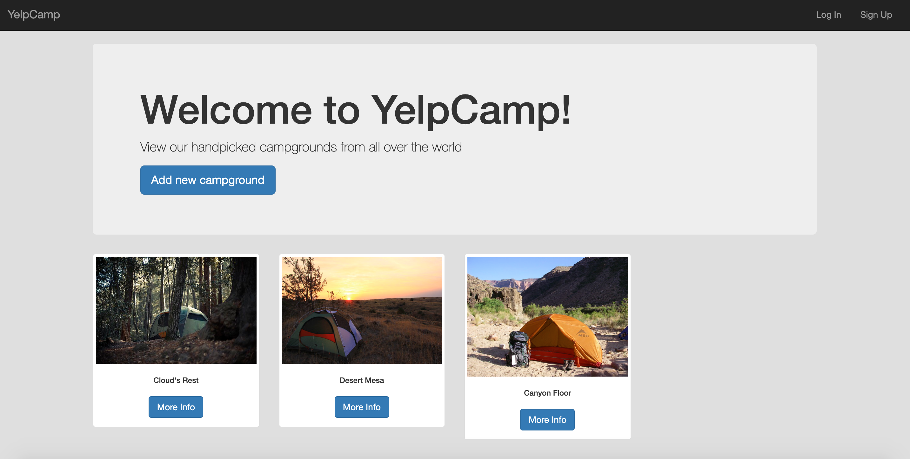
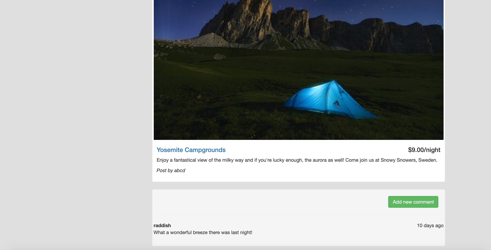

A full stack web application for sharing campgrounds. 

* Landing Page


* Home Page



* Campground Post and Comments



  
# Features
* Responsive design
* Edit and Delete Campgrounds shared
* Post, Edit and Delete comments on Campground posts 
* Authentication (users can login using their username and password) and Authorization (users cannot edit or delete posts if they are not logged in and don't own the post.)

# Tech Stack
Front End:
* HTML
* CSS
* ejs
* Bootstrap

Back End:
* Node.js
* Express
* MongoDB
* RESTful API


# Make sure the following are installed and/or running:
* MongoDB shell (mongod should be active in terminal)  
* Express
* ejs
* mongoose
* passport
* passport-local
* passport-local-mongoose
* body-parser
* method-override

Cross-check the package.json file for these dependencies, if not present run: 
```
npm i -S express ejs mongoose passport passport-local passport-local-mongoose body-parser method-override
```

# Run the app.js file
```
node app.js
```
